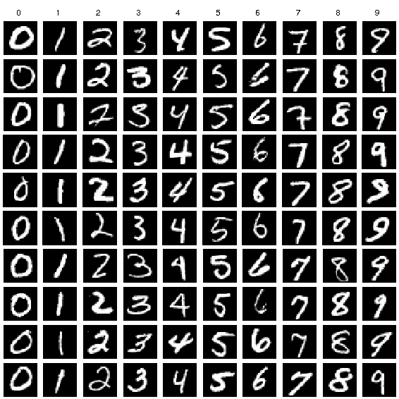

# Introduction

A Convolutional neural network (CNN) model is built and trained with python by the MNIST datasets to recognize hand-written digits. MNIST datasets contains images of digits 0-9 written by human. All image are grey scale (1 channel only) with the size of 28x28 pixels.

Example images from MNIST

The train and test dataset are download under the `dataset.py` file. The dataset are divided into 9 batch sizes and 6 epoch for training under the `train.py` file and the CNN architecture are described as below inside and implemented under the `model.py` file.

0. Input image: 1x28x28
1. Conv layer:
   - input: 1x28x28
   - kernel_size: 5x5
   - in_channels: 1
   - out_channels: 16
   - activation: ReLU
   - output: 16x24x24 feature maps
   - trainable parameters = (5x5+1) x 16 = 416
2. Max pooling:
   - input: 16x24x24 feature maps
   - kernel_size: 2x2
   - output: 16x12x12 feature maps
   - trainable parameters = 16 x 2 = 32
3. Conv layer:
   - input: 16x12x12 feature maps
   - kernel_size: 3x3
   - in_channels: 16
   - out_channels: 32
   - activation: ReLU
   - output: 32x10x10 feature maps
   - trainable parameters = 32 x (3 x 3 x 16 + 1) = 4640
4. Max pooling:
   - input: 32x10x10 feature maps
   - kernel_size: 2x2
   - output: 32x5x5 feature maps
   - trainable parameters = 32 x 2 = 64
5. Conv layer:
   - input: 32x5x5 feature maps
   - kernel_size: 1x1
   - in_channels: 32
   - out_channels: 8
   - activation: ReLU
   - output: 8x5x5 feature maps
   - trainable parameters = 8 x (32 x 1 x1 +1) = 264
6. FC layer:
   - in_features: 8x5x5
   - out_features: 64
   - activation: ReLU
   - Trainable parameters = 64 x (8 x 5 x 5 +1) = 12864
7. FC layer:
   - in_features: 64
   - out_features: 10
   - activation: None
   - Trainable parameters = 10 x (64+1) = 650

# Screenshot

